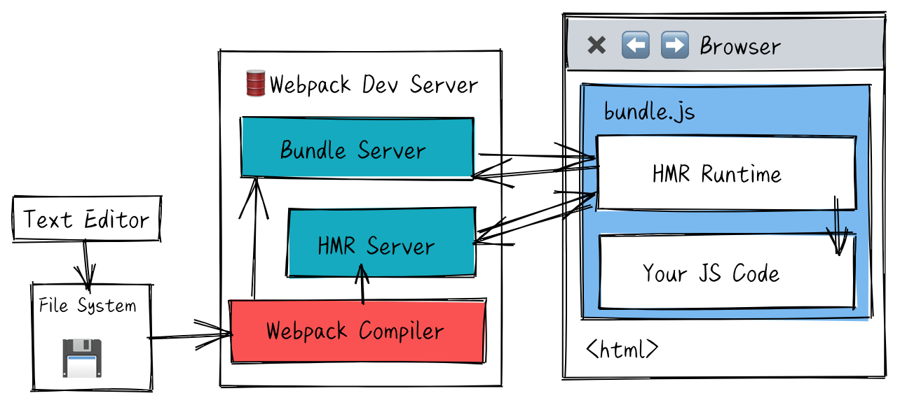

# 学习webpack

[[toc]]

## Original
::: details 官方原文
### Concepts

webpack is a **static** module bundler for modern JavaScript application

it internally builds a [`dependency graph`] from one or more entry points
and then combines every module your project needs into one or more bundles,
which are static assets to serve your content from.

Core concepts:
* Entry
* Output
* Loaders
* Plugins
* Mode
* Browser Compatiblity

一期目标问题
* Manually Bundling an Application
* Live Coding a Simple Module Bundler
* Detailed Explaination of a Simple Module Bundler

### Entry
entry point = which module webpack begin building out its internal **dependency graph**.
figure out depends on(directly or indirectly).

`./src/index.js`

### Output
emit the bundles and specific the names of these files.
`./dist/main.js`
{ path, filename }

### Plugins
leveraged to perform a wider range of tasks like 
bundle optimization , asset management and injection of enviroment variables.
*extend capabilities*
* require it
* push to plugins array
* create instance with `new`

### Mode
development,`production`,none
built-in  optimization that correspond to each environment.

### Browser Compatibility
supports all "ES5-compliant" 
webpack needs Promise for `import()`,`require.ensure()`.
to support older browser you need to load polyfill.

> Webpack 5 runs on Node.js version 10.13.0+

### Scenarios
1. Seperate App and Vender Entries
```json
{
    entry: {
        main: 'xxx',
        vendor: 'yyy'
    },
    output: {
        filename: '[name].[contenthash].bundle.js', // prod
        filename: '[name].bundle.js' // dev
    },
}
```
`optimization.splitChunks` option takes care of seperating vendors and app modules.

### Multiple Entry Points
Output has a unique name.
can use substitutions    `[name]`
:::
## Webpack内容综述
::: tip 章节
* P1-P3 webpack 的基本概念和日常开发的使用技巧
* P4-P5 以工程化的方式组织webpack构建配置，和webpack打包优化
* P6-P7 详细剖析webpack打包原理和插件，以及loader的实现
* P8 从实际web商城项目出发，讲解webpack实际使用
::: 

### 01 webpack与构建发展简史
为什么需要构建工具
* 转换ES6语法
* 转换JSX
* CSS前缀补全/预处理器
* 压缩混淆
* 图片压缩
  
构建演变之路
  `ant+YUI tool --> grunt --> fis3/gulp --> rollup,webpack,parcel`

为什么选择webpack
* 社区生态丰富
* 配置灵活和插件化扩展
* 官方更新迭代速度快
  
初识webpack：配置文件名称

* webpack默认配置文件 `webpack.config.js`
* 可以通过 webpack --config 指定配置文件

初识webpack：配置组成
* entry // 打包的入口文件
* output // 打包的输出
* mode // 环境
* module.rules // Loader配置
* module.plugins // 插件配置

**零配置**webpack包含哪些内容
* 默认entry为 ./src/index.js
* 默认output为 ./dist/main.js
* loader raw-loader
* plugins HtmlwebpackPlugin template:./src/index.html

环境搭建 Node.js 和 NPM

安装webpack和 webpack-cli

webpack初体验

```js
const path=require('path');
module.exports={
    mode: 'production',
    entry: './src/index.js',
    output:{
        path: path.resolve(__dirname,'dist'),
        filename: 'bundle.js'
    }
};
```
--->构建结果
```html
<!doctype html>
<html>
    <head>
        <title>demo</title>
    </head>
    <body>
        <script src="dist/bundle.js"></script>
    </body>
</html>
```
> 通过npm script 运行`webpack`
> 
> **原理** 模块局部安装会在 node_modules/.bin目录创建软链接

### 02 webpack基础用法
Entry 用来指定webpack的打包入口

模块依赖图的入口是 entry
对于非代码比如图片、字体依赖也会不断加入到依赖图中

Entry的用法
* 单入口：entry是一个字符串
* 多入口：entry是一个对象

Output用来告诉webpack 如何将编译后的文件输出到磁盘

Output的用法：单入口配置
```js
module.exports={
    entry:'./path/to/my/entry/file.js'
    output:{
        filename: 'bundle.js'
        path: __dirname + '/dist'
        
    }
}
```
Output的用法：多入口配置
```js
module.exports={
    entry: {
        app: './src/app.js',
        search: './src/search.js'
    },
    output: {
        filename: '[name].js',
        path: __dirname + '/dist'
    }
}
```
> 通过占位符确保文件名称的唯一

* 核心概念之Loaders
  
webpack开箱即用只支持js和json两种文件类型，通过Loaders去支持其他文件类型并且把它们转化成有效的模块，
并且可以添加到依赖图中。
本身是一个函数，接受源文件作为参数，返回转换的结果。

常见的Loaders
| 名称                    | 描述                     |
| ----------------------- | ------------------------ |
| babel-loader            | 转换ES6+等JS新特性语法   |
| css-loader              | 支持.css文件的加载和解析 |
| less-loader,sass-loader | ...                      |
| ts-loader               | 将ts转换成css            |
| file-loader             | 进行图片、字体等的打包   |
| raw-loader              | 将文件以字符串的形式导入 |
| thread-loader           | 多进程打包JS和CSS        |

Loaders 的用法
```js
const path=require('path');

module.exports={
    output:{
        filename: 'bundle.js'
    },
    module:{
        rules:[
            {test:/\.txt$/,use: 'raw-loader'}
        ]
    }
}
```
> `test` 指定匹配规则,`use` 指定使用的loader名称

* 核心概念之Plugins

插件用于bundle文件的优化，资源管理器和环境变量的注入
作用于整个构建过程

常见的Plugins有哪些?
| 名称                     | 描述                                       |
| ------------------------ | ------------------------------------------ |
| CommonsChunkPlugin       | 将chunks相同的模块代码提取成公共js         |
| CleanWebpackPlugin       | 清理构建目录                               |
| ExtractTextWebpackPlugin | 将CSS从bundle文件里提取成一个独立的CSS文件 |
| CopyWebpackPlugin        | 将文件或者文件夹拷贝到构建的输出目录       |
| HtmlWebpackPlugin        | 创建HTML文件去承载输出的bundle             |
| UglifyjsWebpackPlugin    | 压缩JS                                     |
| ZipWebpackPlugin         | 将打包出的资源生成一个zip包                |

Plugins的用法
```js
const path=require('path');

module.exports={
    output:{
        filename: 'bundle.js'
    },
    plugins:[
        new HtmlWebpackPlugin({template:'./src/index.html'})
    ]
}
```
> 放到plugins的数组里面

* 核心概念之Mode
Mode用来指定当前的构建环境是: production development还是none，
设置mode可以使用webpack内置的函数，默认值是production

Mode的内置函数功能
| 选项        | 描述                                                                                |
| ----------- | ----------------------------------------------------------------------------------- |
| development | 设process.env.NODE_ENV 的值为 development. 开启NamedChunksPlugin+NameModulesPlugin. |
| production  | 设process.env.NODE_ENV 的值为 production. 开启"一堆Plugin"                          |
| none        | 不开启任何优化选项                                                                  |

::: tip "一堆Plugin" 
* FlagDependencyUsagePlugin
* FlagIncludedChunksPlugin
* ModuleConcatentationPlugin
* NoEmitOnErrorsPlugin
* OccurenceOrderPlugin
* SideEffectsFlagPlugin
* TerserPlugin
:::

资源解析: 解析ES6
使用babel-loader babel的配置文件是.babelrc
```js
module.exports={
    module:{
        rules:[ {test:/\.js$/,use: 'babel-loader'} ]
    }
}
```

增加ES6的babel preset配置
```json
{
    "presets":["@babel/preset-env"],
    "plugins":["@babel/proposal-class-properties"]
}
```
> 增加ES6 preset配置

资源解析: 解析React JSX

```json
{
    "presets":["@babel/preset-env","@babel/preset-react"],
    "plugins":["@babel/proposal-class-properties"]
}
```
> 增加React的 babel-preset 配置

资源解析: 解析CSS
```js
module.exports={
    module:{
        rules:[
            {test:/\.css$/,use:["style-loader","css-loader"]}
        ]
    }
}
```
> css-loader用于加载.css文件，并且转换成commonjs对象
> style-loader 将样式通过`<style>`标签插入到head中

解析Less和SaSS
less-loader 用于将less转换成css
解析图片
file-loader 用于处理文件 `test: /\.(png|svg|jpg|gif)$/`
解析字体
file-loader 也可以用于处理字体 `test: /\.(woff|woff2|eot|ttf|otf)$/`
使用url-loader
url-loader 也可以处理图片和字体
可以设置较小的资源自动base64
 ```js
 module.exports={
     module:{rules:[
         {test:/\.(png|svg|jpg|git)$/,
         use:[{
             loader: 'url-loader',
             options: {limit: 10240}
         }]}

     ]}
 }
 ```
 webpack中的文件监听
 
文件监听是在发现源码发生变化时，自动重新构建出新的输出文件。

webpack 开启监听模式，有两种方式:
1. 启动 webpack命令时，带上--watch参数
2. 在配置webpack.config.js中设置 watch: true

唯一缺陷：每次需要手动 刷新浏览器

::: details 文件监听原理
轮询判断文件的最后编辑时间是否变化
某个文件发生了变化，并不会立即告诉监听者，而是先缓存起来，等aggregateTimeout

 ```js
 module.exports={
     watch: true, //默认false
     watchOptions:{
         ignored: /node_modules/, // 默认空，不监听的文件(夹),支持正则匹配
         aggregateTimeout: 300, // 监听到变化后会等300ms再去执行，默认300
         poll:1000 // 判断文件是否变化是通过轮询问系统指定文件有没变化实现的，默认每秒问1000次
     }
 }
 ```
:::

热更新 webpack-dev-server
* WDS 不刷新浏览器
* WDS 不输出文件，而是放在内存中
* 使用HotModuleReplacementPlugin插件
`webpack-dev-server --open`

热更新 使用webpack-dev-middleware
WDS将 webpack输出的文件传输给服务器
适用于灵活的定制场景
```js
const express= require('express');
const webpack= require('webpack');
const webpackDevMiddleware=require('webpack-dev-middleware');

const app=express();
const config=require('./webpack.config.js');
const compiler= webpack(config);

app.use(webpackDevMiddleware(compiler,{
    publicPath: config.output.publicPath
}));
app.listen(3000,function(){
    console.log('app listening on port 3000');
})
```

热更新的原理分析

* Webpack Compile: 将JS编译成 Bundle
* HMR Server: 将热更的文件输出给 HMR Runtime
* Bundle server: 提供文件在浏览器的访问
* HMR Runtime: 会被注入到浏览器，更新文件的变化
* bundle.js: 构建输出的文件



* 什么是文件指纹?
  打包后输出的文件名的后缀
hash串
文件指纹如何生成
* Hash：和整个项目的构建相关，只要项目文件有修改，整个项目构建的hash值就会更改
* Chunkhash：和webpack打包的chunk有关，不同的entry会生成不同的chunkhash值
* Contenthash: 根据文件内容来定义hash，文件内容不变，则contenthash不变

JS的文件指纹设置
设置output的filename，使用[chunkhash]
`output:{ filename: '[name][chunkhash:8].js' }`
CSS文件的指纹设置
设置MiniCssExtractPlugin的filename,使用[contenthash]
```js
new MiniCssExtractPlugin({ filename: `[name][contenthash:8].css`})
```

图片文件的指纹设置
设置file-loader的name，使用[hash]
`use: [{loader:'file-loader',options:{name:'img/[name][hash:8].[ext]'}}]`
| 占位符名称  | 含义                          |
| ----------- | ----------------------------- |
| ext         | 资源的后缀名                  |
| name        | 文件名称                      |
| path        | 文件的相对路径                |
| folder      | 文件所在的文件夹              |
| contenthash | 文件的内容hash，默认md5生成   |
| hash        | 文件内容的Hash,默认md5生成    |
| emoji       | 一个随机的指代文件内容的emoji |

代码压缩
HTML压缩 CSS压缩 JS压缩

JS文件的压缩 内置了uglifyjs-webpack-plugin
CSS文件的压缩 使用optimize-css-assets-webpack-plugin，同时使用 cssnano
```js
plugins:[
    new OptimizeCSSAssetsPlugin({
        assetsNameRegExp:/\.css$/g,
        cssProcessor: require('cssnano')
    })
]
```
html文件的压缩 修改html-webpack-plugin, 设置压缩参数
```js
new HtmlWebpackPlugin({
    template: path.join(__dirname,'src/search.html'),
    filename: 'search.html',
    chunks:['search'],
    inject: true,
    minify:{
        html5: true,
        collapseWhitespace: true,
        preserveLineBreaks: false,
        minifyCSS: true,
        minifyJS: true,
        removeComments: false
    }
})
```


